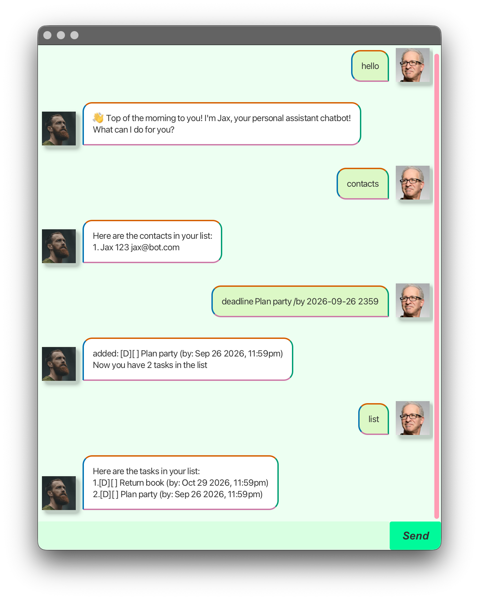

# Jax User Guide



Jax is a personal assistant chatbot that helps you keep track of your tasks and contacts. It is optimized for use via a Command Line Interface (CLI) while still having the benefits of a Graphical User Interface (GUI).

## Quick Start

1.  Ensure you have Java `17` or above installed in your Computer.
2.  Download the latest `Jax.jar` from the releases page.
3.  Copy the file to the folder you want to use as the _home folder_ for your Jax.
4.  Open a command terminal, `cd` into the folder you put the jar file in, and use the following command to run the application:
    ```
    java -jar Jax.jar
    ```
5.  Type the command in the command box and press Enter to execute it. e.g. typing `help` and pressing Enter will open the help window.
    Some example commands you can try:

    *   `list` : Lists all tasks.
    *   `todo read book` : Adds a todo task "read book" to the task list.
    *   `deadline return book /by 2024-02-20 1800` : Adds a deadline task "return book" by Feb 20th 2024, 6pm.
    *   `delete 1` : Deletes the 1st task in the current list.
    *   `bye` : Exits the app.

6.  Refer to the [Features](#features) below for details of each command.

## Features

### Adding a Todo Task: `todo`

Adds a todo task to the task list.

Format: `todo <description>`

Example: `todo read book`

### Adding a Deadline Task: `deadline`

Adds a deadline task to the task list.

Format: `deadline <description> /by <yyyy-MM-dd HHmm>`

Example: `deadline return book /by 2024-02-20 1800`

### Adding an Event Task: `event`

Adds an event task to the task list.

Format: `event <description> /from <yyyy-MM-dd HHmm> /to <yyyy-MM-dd HHmm>`

Example: `event project meeting /from 2024-02-20 1400 /to 2024-02-20 1600`

### Listing All Tasks: `list`

Shows a list of all tasks in the task list.

Format: `list`

### Marking a Task as Done: `mark`

Marks a task as done.

Format: `mark <index>`

*   Marks the task at the specified `index` as done.
*   The index refers to the index number shown in the displayed task list.
*   The index **must be a positive integer** 1, 2, 3, …

Example: `mark 1`

### Marking a Task as Not Done: `unmark`

Marks a task as not done.

Format: `unmark <index>`

*   Marks the task at the specified `index` as not done.
*   The index refers to the index number shown in the displayed task list.
*   The index **must be a positive integer** 1, 2, 3, …

Example: `unmark 1`

### Deleting a Task: `delete`

Deletes the specified task from the task list.

Format: `delete <index>`

*   Deletes the task at the specified `index`.
*   The index refers to the index number shown in the displayed task list.
*   The index **must be a positive integer** 1, 2, 3, …

Example: `delete 1`

### Finding Tasks: `find`

Finds tasks whose names contain the given keyword.

Format: `find <keyword>`

*   The search is case-insensitive. e.g `book` will match `Book`
*   The order of the keywords does not matter. e.g. `read book` will match `book read`
*   Only the description is searched.
*   Partial words will be matched e.g. `rea` will match `read`

Example: `find book`

### Adding a Contact: `contact`

Adds a contact to the contact list.

Format: `contact <name> /p <phone> /e <email>`

Example: `contact John Doe /p 98765432 /e johndoe@example.com`

### Deleting a Contact: `delcontact`

Deletes a contact from the contact list.

Format: `delcontact <name>`

*   Deletes the contact with the specified `name`.
*   The name is case-insensitive.

Example: `delcontact John Doe`

### Listing All Contacts: `contacts`

Shows a list of all contacts in the contact list.

Format: `contacts`

### Clearing All Data: `clear`

Clears all tasks and contacts.

Format: `clear`

### Exiting the Program: `bye`

Exits the program.

Format: `bye`

### Saving the Data

Jax data are saved in the hard disk automatically after any command that changes the data. There is no need to save manually.

### Editing the Data File

Jax data are saved as text files in `data/tasks.txt` and `data/contacts.txt`. Advanced users are welcome to update data directly by editing that file.

> **Caution:**
> If your changes to the data file makes its format invalid, Jax will discard all data and start with an empty data file at the next run.
